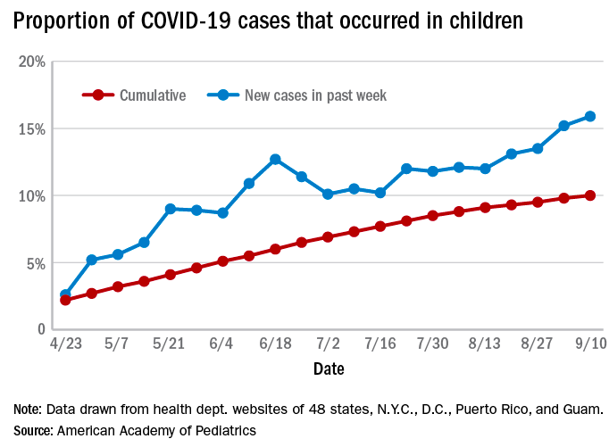

#### Created by: Jerry Chao (JYC2171), Sal El-Sadek (SNE2114), Kyung Suk Lee (KL3069), and Lusha Liang (LL3344)

## Introduction

Coronavirus disease 2019 (COVID-19) is a global pandemic caused by the severe acute respiratory syndrome coronavirus 2 (SARS-CoV-2), which has now affected over 65 million people around the world, with over 1 million fatalities. In the United States, more than 1 million children have been diagnosed with COVID-19, though this may be an undercount as children's symptoms are often mild and they may not be tested for every illness. 

While the clinical characteristics and hospital courses of patients with COVID-19 have been previously described, particularly in adults, the risk factors associated with hospitalization in pediatric patients has been understudied.  Fortunately, COVID-19 seems to affect children generally less severely than adults. However, some children do become ill enough to require hospitalization. Moreover, as the number of cases continues to rise across the country, COVID-19 cases in pediatric patients also continues to increase. 

Here, we present our analyses of a dataset of 375 pediatric patients who returned a positive SARS-CoV-2 RT PCR test at a single tertiary care medical center in New York City from the beginning of the COVID-19 pandemic until October 1, 2020.

## The dataset

The dataset contains de-identified patient health information consisting of age (from 0 to up to 23 years), demographic data (including biological sex, zip code of residence, and a socioeconomic status variable generated from census-block groups), whether there was a preceding visit to the Emergency Department, any past medical history of asthma, obesity, and/or diabetes, and whether there was an admission to the intensive care unit.

The goal of this project was to perform an exploratory analysis of this dataset in order to begin to assess the risk factors associated with pediatric hospitalization for COVID-19 infection. Prior studies have shown that clinical features including low oxygen saturation and abnormal chest imaging are predictive of hospitalization.  In this final project, our focus was an exploration of demographic characteristics and pre-existing comorbidities that might predict more severe COVID-19 infection requiring hospitalization. We hypothesize that increasing age, a past medical history of asthma, obesity, and diabetes are positively associated with hospitalization.