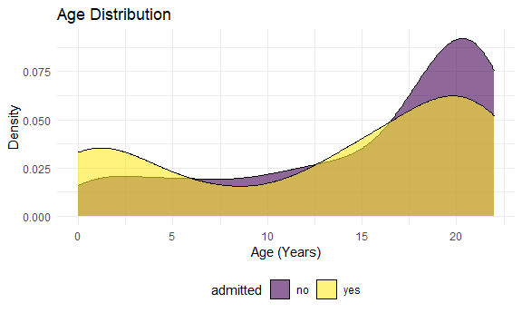

P8105 Final Project - Pediatric COVID
================
Jerry Chao (jyc2171), Lusha Liang (LL3344), Kyung Suk Lee (KL3069), Sal
El-Sadek (sne2114)
November 6, 2020

This is an initial R Markdown file for our Final Project for P8105. We
are working with a Pediatric COVID dataset. First, some setup.

    ## ── Attaching packages ──────────────────────────────────────────────────────────────────────────────────── tidyverse 1.3.0 ──

    ## ✓ ggplot2 3.3.2     ✓ purrr   0.3.4
    ## ✓ tibble  3.0.3     ✓ dplyr   1.0.2
    ## ✓ tidyr   1.1.2     ✓ stringr 1.4.0
    ## ✓ readr   1.3.1     ✓ forcats 0.5.0

    ## ── Conflicts ─────────────────────────────────────────────────────────────────────────────────────── tidyverse_conflicts() ──
    ## x dplyr::filter() masks stats::filter()
    ## x dplyr::lag()    masks stats::lag()

I have created a private GitHub repository and I will invite all members
of the team as collaborators so we all have access to the repo. The
repository is called “p8105\_final\_ped\_covid.”

Next, I will read in the .csv file, which I have de-identified. I had
also begun to clean the data, but there is more work to do.

``` r
ped_covid =
  read_csv("./data/p8105_final_ped_covid.csv")
```

    ## Parsed with column specification:
    ## cols(
    ##   .default = col_character(),
    ##   id = col_double(),
    ##   age = col_double(),
    ##   censusblock = col_double(),
    ##   censusblockgroup = col_double(),
    ##   censustract = col_double(),
    ##   ses = col_double(),
    ##   zip_code_set = col_double(),
    ##   bmi_yes_or_no = col_double(),
    ##   bmi_value = col_double(),
    ##   icu_yes_no = col_double(),
    ##   systolic_bp_value = col_double(),
    ##   ed_yes_no_0_365_before = col_double()
    ## )

    ## See spec(...) for full column specifications.

This is a de-identified dataset of pediatric patients from a tertiary
care medical center who tested positive for COVID on SARS-CoV-2 RT PCR
test and whether or not they were hospitalized. The age range in the
study is 0 to 23 years of age. I have randomly generated an id number
for each patient. There are 375 rows (patients) and 30 columns in this
dataset. The variables are date and time of positive covid test
(“eventdatetime”), whether the patient was admitted (“admitted”),
whether there was a preceding emergency department visit
(“ed\_yes\_no\_0\_365\_before”), whether the patient needed intensive
care admission (“icu\_yes\_no”) and date and time of icu admission
(“icu\_date\_time”), demographic data (age, gender, ethnicity, race,
zip code data - predominantly in the Bronx), some past medical history
data (bmi data, asthma data, diabetes data) and one vital sign datum
(systolic blood pressure). This will set the stage for our discussion
and further analyses. We can also request additional data, with a
turnaround time of probably \~1 week.

I am excited\! To get everyone excited, I have generated a density plot
of the age distribution in this dataset by admission (yes/no).

``` r
ped_covid %>% 
ggplot(aes(x = age, fill = admitted)) +
  geom_density(alpha = .6) +
  labs(
    title = "Age Distribution",
    x = "Age (Years)",
    y = "Density"
  ) +
  viridis::scale_color_viridis(discrete = TRUE) +
  theme_minimal() +
  theme(legend.position = "bottom")
```



There appears to be a bimodal age distribution of pediatric patients who
tested positive for COVID-19 with more admissions during the first 2.5
years of life and also among older teenagers (15-20 years). There are
less patients admitted in the toddler and small child age range (3-10).
