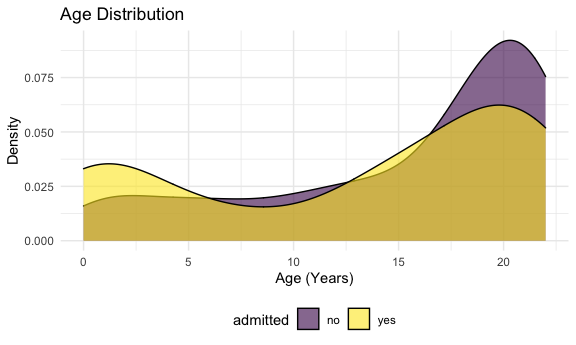

P8105 Final Project Proposal-Pediatric COVID
================
Jerry Chao, Lusha Liang, Sal El-Sadek, Kyung Suk Lee
2020-11-27

  - [Introduction](#introduction)
  - [Motivation for this project](#motivation-for-this-project)
  - [Anticipated data sources](#anticipated-data-sources)
  - [Intended final products](#intended-final-products)
  - [Planned analyses / visualizations / coding
    challenges](#planned-analyses-visualizations-coding-challenges)
  - [Planned timeline](#planned-timeline)
  - [Word count](#word-count)

``` r
library(tidyverse)

knitr::opts_chunk$set(
  fig.width = 6,
  fig.asp = .6,
  out.width = "90%")

theme_set(theme_minimal() + theme(legend.position = "bottom"))

options(
  ggplot2.continuous.colour = "viridis",
  ggplot2.continuous.fill = "viridis")

scale_colour_discrete = scale_color_viridis_d
scale_fill_discrete = scale_fill_viridis_d

knitr::opts_chunk$set(comment = NA, message = FALSE, warning = FALSE, echo = TRUE)
```

## Introduction

  - The group members in this final project team are **Jerry Chao
    (JYC2171)**, **Lusha Liang (LL3344)**, **Sal El-Sadek (SNE2114)**,
    and **Kyung Suk Lee (KL3069)**.
  - The tentative title for our project is **Pediatric COVID**.
  - The private repository called **p8105\_final\_ped\_covid** was
    created with access granted to members of our team, as well as
    “bst-p8105”. The dataset contains de-identified patient health
    information.

## Motivation for this project

There has been a lot of research done concerning COVID-19 in the past
year, but not much focus, relatively speaking, is given to how COVID-19
affects children and young adults given the low fatality rate of those
age groups. Our goal in this project is to look at the severity of
COVID-19 in young people and how various common comorbidities can affect
the risk of having a more sever case of COVID-19.

Jerry’s - While COVID seems to affect adults more than children, some
pediatric patients do become ill and even require hospitalization. Most
studies have described clinical characteristics of children already
admitted to hospital and their course during admission - but more can be
learned about risk factors associated with the need hospitalization
prior to admission.

We would like to leverage the skills learned in p8105 and the data
visualization capabilities in R to explore clinical question mentioned
below.

  - **Article 1:** [Hospitalization Rates and Characteristics of
    Children Aged \< 18 years Hospitalized with
    COVID-19](https://www.cdc.gov/mmwr/volumes/69/wr/mm6932e3.htm#)
  - **Article 2:** [Clinical Characteristics and Outcomes of
    Hospitalized and Critically Ill Children and Adolescents with
    COVID-19 at a Tertiary Care Medical Center in
    NYC](https://www.ncbi.nlm.nih.gov/pmc/articles/PMC7212947/)

## Anticipated data sources

``` r
ped_covid =
  read_csv("./data/p8105_final_ped_covid.csv")

ped_covid %>% 
  head()
```

    # A tibble: 6 x 30
         id admitted   age date_of_birth ethnicity gender censusblock
      <dbl> <chr>    <dbl> <chr>         <chr>     <chr>        <dbl>
    1     1 no          17 8/10/2003 0:~ E2 Not S~ M          3.60e14
    2     2 no          22 5/26/1998 0:~ E2 Not S~ M          3.60e14
    3     3 yes         22 8/12/1997 0:~ E1 Spani~ M          3.61e14
    4     4 no          19 5/17/2000 0:~ E1 Spani~ M          3.60e14
    5     5 no          20 1/17/2000 0:~ E1 Spani~ F          3.60e14
    6     6 yes         21 12/18/1998 0~ E1 Spani~ M         NA      
    # ... with 23 more variables: censusblockgroup <dbl>, censustract <dbl>,
    #   city <chr>, race <chr>, ses <dbl>, state <chr>, zip_code_set <dbl>,
    #   eventdatetime <chr>,
    #   outcomeadmission_admission_1inpatient_admit_service <chr>,
    #   bmi_yes_or_no <dbl>, bmi_event_date_time <chr>, bmi_value <dbl>,
    #   asthma_date_time <chr>, asthma_dx <chr>, diabetes_date_time <chr>,
    #   diabetes_dx <chr>, icu_yes_no <dbl>, icu_date_time <chr>,
    #   systolic_bp_event_date_time <chr>, systolic_bp_value <dbl>,
    #   ed_yes_no_0_365_before <dbl>, admission_primary_dx <chr>,
    #   admission_apr_drg <chr>

  - **Source 1:** ***(Initial data gathering by Jerry Chao)*** This is a
    de-identified dataset of pediatric patients from a tertiary care
    medical center who tested positive for COVID-19 on SARS-CoV-2 RT PCR
    test and infrormation on whether or not they were hospitalized. The
    age range in the study is **0** to **22** years of age. An id number
    for each patient has been randomly generated. There are **375** rows
    (patients) and **30** columns in this dataset. The variables
    included in this dataset are *id, admitted, age, date\_of\_birth,
    ethnicity, gender, censusblock, censusblockgroup, censustract, city,
    race, ses, state, zip\_code\_set, eventdatetime,
    outcomeadmission\_admission\_1inpatient\_admit\_service,
    bmi\_yes\_or\_no, bmi\_event\_date\_time, bmi\_value,
    asthma\_date\_time, asthma\_dx, diabetes\_date\_time, diabetes\_dx,
    icu\_yes\_no, icu\_date\_time, systolic\_bp\_event\_date\_time,
    systolic\_bp\_value, ed\_yes\_no\_0\_365\_before,
    admission\_primary\_dx, admission\_apr\_drg*. Some of the important
    variables are date and time of positive covid test
    (“eventdatetime”), whether the patient was admitted
    (“admitted”), whether there was a preceding emergency department
    visit (“ed\_yes\_no\_0\_365\_before”), whether the patient needed
    intensive care admission (“icu\_yes\_no”) and date and time of icu
    admission (“icu\_date\_time”), demographic data (age, gender,
    ethnicity, race, zip code data - predominantly in the Bronx), some
    past medical history data (bmi data, asthma data, diabetes data) and
    one vital sign datum (systolic blood pressure).

  - **Source 2:** [NYC Coronavirus Disease 2019 (COVID-19)
    Data](https://github.com/nychealth/coronavirus-data)

  - **Source 3:** [NYC
    OpenData](https://data.cityofnewyork.us/Health/COVID-19-Outcomes-by-Testing-Cohorts-Cases-Hospita/cwmx-mvra)

## Intended final products

  - An interactive dashboard using plotly to present univariate and
    multivariate regression models assessing the association of
    demographic factors and past medical history with the need for
    hospital admission among pediatric patients.
  - Youtube video describing our final products.

## Planned analyses / visualizations / coding challenges

  - ***Analyses:*** We plan to perform univariate analyses describing
    demographic and past medical history by admission status (yes/no).
    We will also perform multivariate logistic regression modeling to
    assess the association of demographic factors and past medical
    history with the need for hospital admission in infants, children,
    and teens. In particular, we will assess increasing age, SES, past
    medical history (in particular asthma, obesity - defined as body
    mass index \> 95% by age & gender, and diabetes) as hypothesized
    risk factors of interest.

  - ***Visualizations:*** We are planning to make various plots (e.g.,
    scatterplot, boxplot, barplot, lineplots) with interactivity using
    `plot_ly` to provide a platform for online data analytics and
    visualizations where users can observe information by zooming and
    hovering. Also, we plan to integrate different plots into dashboard
    using `shinydashboard` which will facilitate users’ understanding in
    an easy-to-read format. The density plot below showing the
    distribution of age by admission status is one of the visualization
    examples. We have generated a density plot of the age in this
    dataset by admission (yes/no). There appears to be a bimodal age
    distribution of pediatric patients who tested positive for COVID-19
    with more admissions during the first 2.5 years of life and also
    among older teenagers (15-20 years). There are less patients
    admitted in the toddler and small child age range (3-10).

<!-- end list -->

``` r
ped_covid %>% 
  ggplot(aes(x = age, fill = admitted)) +
  geom_density(alpha = .6) +
  labs(
    title = "Age Distribution",
    x = "Age (Years)",
    y = "Density") +
  viridis::scale_color_viridis(discrete = TRUE) +
  theme_minimal() +
  theme(legend.position = "bottom")
```



  - ***Coding challenges:*** Most of the coding will require extensive
    data wrangling, such as changing the variables to right format,
    removing white-spaces, identifying any outliers, dealing with missed
    values, merging latitude and longitude information for mapping, and
    tidying the data. Also, since we plan to use `shinydashboard`,
    integrating all the necessary codes for visualization can be a
    challenge.

## Planned timeline

We plan to meet once or twice a week to discuss project progress. The
tentative timeline is outlined below:

  - *By mid November:* Finalize additional sources of data, if needed.
  - *By end of November:* Complete all visualizations.
  - *By early December:* Integrate all visualizations into
    `shinydashboard` and create website.
  - *By Dec 10th:* Make modifications based on peer-assessment for the
    final presentation.

## Word count

``` r
wordcountaddin::text_stats("proposal.Rmd")
```

| Method          | koRpus      | stringi       |
| :-------------- | :---------- | :------------ |
| Word count      | 495         | 496           |
| Character count | 3300        | 3300          |
| Sentence count  | 33          | Not available |
| Reading time    | 2.5 minutes | 2.5 minutes   |
