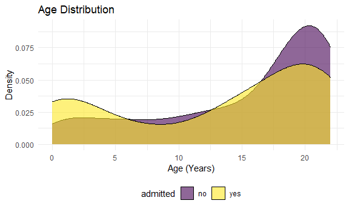

P8105 Final Project Proposal-Pediatric COVID
================
Jerry Chao, Lusha Liang, Sal El-Sadek, Kyung Suk Lee
2020-11-06

  - [Introduction](#introduction)
  - [The motivation for this project](#the-motivation-for-this-project)
  - [The anticipated data sources](#the-anticipated-data-sources)
  - [The intended final products](#the-intended-final-products)
  - [The planned analyses / visualizations / coding
    challenges](#the-planned-analyses-visualizations-coding-challenges)
  - [The planned timeline](#the-planned-timeline)
  - [Word count](#word-count)

``` r
library(tidyverse)

knitr::opts_chunk$set(
  fig.width = 6,
  fig.asp = .6,
  out.width = "90%")

theme_set(theme_minimal() + theme(legend.position = "bottom"))

options(
  ggplot2.continuous.colour = "viridis",
  ggplot2.continuous.fill = "viridis")

scale_colour_discrete = scale_color_viridis_d
scale_fill_discrete = scale_fill_viridis_d

knitr::opts_chunk$set(comment = NA, message = FALSE, warning = FALSE, echo = TRUE)
```

## Introduction

  - The group members for our final project includes **Jerry Chao
    (JYC2171)**, **Lusha Liang (LL3344)**, **Sal El-Sadek (SNE2114)**,
    and **Kyung Suk Lee (KL3069)**.
  - The tentative title for our project is **Pediatric COVID**.
  - The private repository called **p8105\_final\_ped\_covid** was
    created with access to all members of the team as collaborators
    since we are using dataset which comprises of patient’s health
    information. However, we have de-identified the data in order to
    remove all personally identifiable information.

## The motivation for this project

## The anticipated data sources

``` r
ped_covid =
  read_csv("./data/p8105_final_ped_covid.csv") %>% 
  head()
ped_covid
```

    # A tibble: 6 x 30
         id admitted   age date_of_birth ethnicity gender censusblock
      <dbl> <chr>    <dbl> <chr>         <chr>     <chr>        <dbl>
    1     1 no          17 8/10/2003 0:~ E2 Not S~ M          3.60e14
    2     2 no          22 5/26/1998 0:~ E2 Not S~ M          3.60e14
    3     3 yes         22 8/12/1997 0:~ E1 Spani~ M          3.61e14
    4     4 no          19 5/17/2000 0:~ E1 Spani~ M          3.60e14
    5     5 no          20 1/17/2000 0:~ E1 Spani~ F          3.60e14
    6     6 yes         21 12/18/1998 0~ E1 Spani~ M         NA      
    # ... with 23 more variables: censusblockgroup <dbl>, censustract <dbl>,
    #   city <chr>, race <chr>, ses <dbl>, state <chr>, zip_code_set <dbl>,
    #   eventdatetime <chr>,
    #   outcomeadmission_admission_1inpatient_admit_service <chr>,
    #   bmi_yes_or_no <dbl>, bmi_event_date_time <chr>, bmi_value <dbl>,
    #   asthma_date_time <chr>, asthma_dx <chr>, diabetes_date_time <chr>,
    #   diabetes_dx <chr>, icu_yes_no <dbl>, icu_date_time <chr>,
    #   systolic_bp_event_date_time <chr>, systolic_bp_value <dbl>,
    #   ed_yes_no_0_365_before <dbl>, admission_primary_dx <chr>,
    #   admission_apr_drg <chr>

This is a de-identified dataset of pediatric patients from a tertiary
care medical center who tested positive for COVID on SARS-CoV-2 RT PCR
test and whether or not they were hospitalized. The age range in the
study is 0 to 23 years of age. I have randomly generated an id number
for each patient. There are 6 rows (patients) and 30 columns in this
dataset. The variables are date and time of positive covid test
(“eventdatetime”), whether the patient was admitted (“admitted”),
whether there was a preceding emergency department visit
(“ed\_yes\_no\_0\_365\_before”), whether the patient needed intensive
care admission (“icu\_yes\_no”) and date and time of icu admission
(“icu\_date\_time”), demographic data (age, gender, ethnicity, race,
zip code data - predominantly in the Bronx), some past medical history
data (bmi data, asthma data, diabetes data) and one vital sign datum
(systolic blood pressure). This will set the stage for our discussion
and further analyses. We can also request additional data, with a
turnaround time of probably \~1 week.

## The intended final products

``` r
ped_covid %>% 
  ggplot(aes(x = age, fill = admitted)) +
  geom_density(alpha = .6) +
  labs(
    title = "Age Distribution",
    x = "Age (Years)",
    y = "Density") +
  viridis::scale_color_viridis(discrete = TRUE) +
  theme_minimal() +
  theme(legend.position = "bottom")
```



We have generated a density plot of the age distribution in this dataset
by admission (yes/no). There appears to be a bimodal age distribution of
pediatric patients who tested positive for COVID-19 with more admissions
during the first 2.5 years of life and also among older teenagers (15-20
years). There are less patients admitted in the toddler and small child
age range (3-10).

## The planned analyses / visualizations / coding challenges

## The planned timeline

## Word count

``` r
wordcountaddin::text_stats("proposal.Rmd")
```

| Method          | koRpus      | stringi       |
| :-------------- | :---------- | :------------ |
| Word count      | 339         | 333           |
| Character count | 2155        | 2155          |
| Sentence count  | 15          | Not available |
| Reading time    | 1.7 minutes | 1.7 minutes   |
