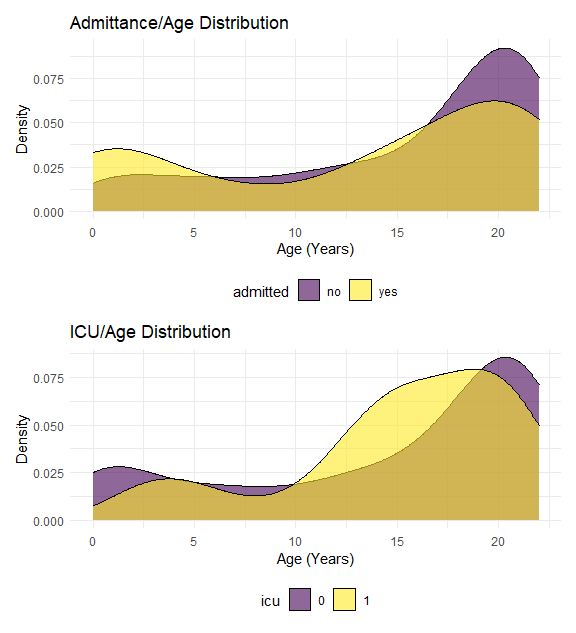
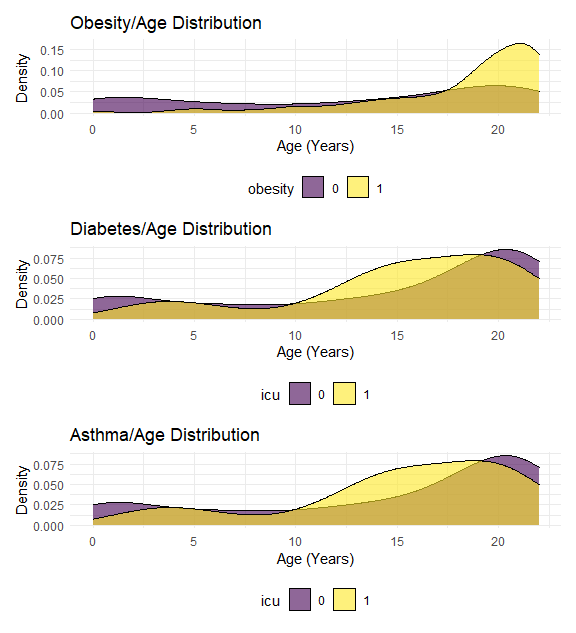
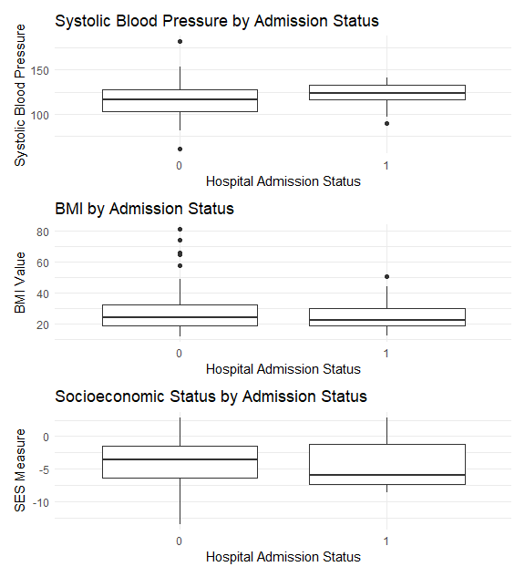

statistical\_analysis
================

Setup

``` r
library(tidyverse)
```

    ## -- Attaching packages --------------------------------------- tidyverse 1.3.0 --

    ## v ggplot2 3.3.2     v purrr   0.3.4
    ## v tibble  3.0.4     v dplyr   1.0.2
    ## v tidyr   1.1.2     v stringr 1.4.0
    ## v readr   1.4.0     v forcats 0.5.0

    ## -- Conflicts ------------------------------------------ tidyverse_conflicts() --
    ## x dplyr::filter() masks stats::filter()
    ## x dplyr::lag()    masks stats::lag()

``` r
library(aod)
library(patchwork)

knitr::opts_chunk$set(
  fig.width = 6,
  fig.asp = 1.1,
  out.width = "100%")

theme_set(theme_minimal() + theme(legend.position = "bottom"))

options(
  ggplot2.continuous.colour = "viridis",
  ggplot2.continuous.fill = "viridis")

scale_colour_discrete = scale_color_viridis_d
scale_fill_discrete = scale_fill_viridis_d

knitr::opts_chunk$set(comment = NA, message = FALSE, warning = FALSE, echo = TRUE)
```

Data import and tidy

``` r
data_stats = read_csv("./datacomplete.csv") %>% 
  mutate_at(c("admitted", "ethnicity_race", "asthma", "diabetes", "gender", "obesity", "icu"), as.factor) %>% 
  select(admitted, icu, age, ethnicity_race, gender, ses, obesity, bmi_value, systolic_bp_value, asthma, diabetes)

summary(data_stats)
```

``` 
 admitted  icu          age                ethnicity_race gender 
 no :250   0:355   Min.   : 0.00   american indian:  2    F:190  
 yes:125   1: 20   1st Qu.:10.00   asian          : 14    M:185  
                   Median :18.00   black          : 92           
                   Mean   :14.63   caucasian      : 21           
                   3rd Qu.:21.00   latino         :228           
                   Max.   :22.00   multiple       : 18           
      ses          obesity   bmi_value     systolic_bp_value asthma  diabetes
 Min.   :-13.506   0:249   Min.   :12.03   Min.   : 61.0     0:314   0:358   
 1st Qu.: -6.496   1:126   1st Qu.:19.04   1st Qu.:103.0     1: 61   1: 17   
 Median : -3.637           Median :24.03   Median :117.0                     
 Mean   : -3.892           Mean   :26.54   Mean   :115.3                     
 3rd Qu.: -1.419           3rd Qu.:32.12   3rd Qu.:128.0                     
 Max.   :  2.931           Max.   :80.84   Max.   :182.0                     
```

Focusing on which predictors matter most in predicting hospitalization
(‘admitted’) or even admittance to an ICU. Need to decide if we need
to focus on predictability or causality/statistical significance.

First, let’s get familiar with the data.

``` r
admitt_p = 
  data_stats %>% 
  ggplot(aes(x = age, fill = admitted)) +
  geom_density(alpha = .6) +
  labs(
    title = "Admittance/Age Distribution",
    x = "Age (Years)",
    y = "Density") +
  theme(legend.position = "bottom")

icu_p = 
  data_stats %>% 
  ggplot(aes(x = age, fill = icu)) +
  geom_density(alpha = .6) +
  labs(
    title = "ICU/Age Distribution",
    x = "Age (Years)",
    y = "Density") +
  theme(legend.position = "bottom")

admitt_p / icu_p
```



``` r
obesity_p = 
  data_stats %>% 
  ggplot(aes(x = age, fill = obesity)) +
  geom_density(alpha = .6) +
  labs(
    title = "Obesity/Age Distribution",
    x = "Age (Years)",
    y = "Density") +
  theme(legend.position = "bottom")

diabetes_p = 
  data_stats %>% 
  ggplot(aes(x = age, fill = icu)) +
  geom_density(alpha = .6) +
  labs(
    title = "Diabetes/Age Distribution",
    x = "Age (Years)",
    y = "Density") +
  theme(legend.position = "bottom")

asthma_p = 
  data_stats %>% 
  ggplot(aes(x = age, fill = icu)) +
  geom_density(alpha = .6) +
  labs(
    title = "Asthma/Age Distribution",
    x = "Age (Years)",
    y = "Density") +
  theme(legend.position = "bottom")

obesity_p / diabetes_p / asthma_p
```



``` r
bp_p =
  data_stats %>% 
  ggplot(aes(x = icu, y = systolic_bp_value)) +
  geom_boxplot() +
  labs(
    title = "Systolic Blood Pressure by Admission Status",
    x = "Hospital Admission Status",
    y = "Systolic Blood Pressure")

bmi_p =
  data_stats %>% 
  ggplot(aes(x = icu, y = bmi_value)) +
  geom_boxplot() +
  labs(
    title = "BMI by Admission Status",
    x = "Hospital Admission Status",
    y = "BMI Value")

ses_p =
  data_stats %>% 
  ggplot(aes(x = icu, y = ses)) +
  geom_boxplot() +
  labs(
    title = "Socioeconomic Status by Admission Status",
    x = "Hospital Admission Status",
    y = "SES Measure")

bp_p / bmi_p / ses_p
```



Possible Models

``` r
  initial_fit = 
  glm(admitted ~ age + gender + ethnicity_race + asthma + diabetes + obesity, 
      family = binomial(link = "logit"), 
      data = data_stats) %>% 
  broom::tidy() %>% 
  mutate(OR = exp(estimate)) %>% 
  select(term, p.value, everything()) %>% 
  knitr::kable(digits = 3)
initial_fit
```

| term                     | p.value | estimate | std.error | statistic |          OR |
| :----------------------- | ------: | -------: | --------: | --------: | ----------: |
| (Intercept)              |   0.981 | \-13.979 |   589.290 |   \-0.024 |       0.000 |
| age                      |   0.001 |  \-0.055 |     0.017 |   \-3.266 |       0.946 |
| genderM                  |   0.879 |  \-0.035 |     0.232 |   \-0.152 |       0.965 |
| ethnicity\_raceasian     |   0.981 |   14.317 |   589.291 |     0.024 | 1651035.503 |
| ethnicity\_raceblack     |   0.981 |   13.905 |   589.290 |     0.024 | 1093265.499 |
| ethnicity\_racecaucasian |   0.981 |   14.182 |   589.290 |     0.024 | 1442205.021 |
| ethnicity\_racelatino    |   0.981 |   13.892 |   589.290 |     0.024 | 1079344.538 |
| ethnicity\_racemultiple  |   0.982 |   13.242 |   589.291 |     0.022 |  563779.890 |
| asthma1                  |   0.074 |    0.562 |     0.315 |     1.788 |       1.755 |
| diabetes1                |   0.001 |    2.035 |     0.598 |     3.403 |       7.651 |
| obesity1                 |   0.982 |  \-0.006 |     0.278 |   \-0.023 |       0.994 |

``` r
##wald.test(b = coef(initial_fit), Sigma = vcov(initial_fit), Terms = 4:8)
```

``` r
complex_fit = 
  glm(admitted ~ age + gender + ethnicity_race + asthma + diabetes + bmi_value + systolic_bp_value + ses, 
      family = binomial(link = "logit"), 
      data = data_stats) %>% 
  broom::tidy() %>% 
  mutate(OR = exp(estimate)) %>% 
  select(term, p.value, everything()) %>% 
  knitr::kable(digits = 3)
complex_fit
```

| term                     | p.value | estimate | std.error | statistic |          OR |
| :----------------------- | ------: | -------: | --------: | --------: | ----------: |
| (Intercept)              |   0.980 | \-14.922 |   594.624 |   \-0.025 |       0.000 |
| age                      |   0.000 |  \-0.074 |     0.021 |   \-3.562 |       0.928 |
| genderM                  |   0.515 |  \-0.162 |     0.248 |   \-0.652 |       0.851 |
| ethnicity\_raceasian     |   0.981 |   14.152 |   594.623 |     0.024 | 1399857.335 |
| ethnicity\_raceblack     |   0.982 |   13.666 |   594.623 |     0.023 |  861156.134 |
| ethnicity\_racecaucasian |   0.981 |   13.993 |   594.623 |     0.024 | 1193750.505 |
| ethnicity\_racelatino    |   0.982 |   13.621 |   594.623 |     0.023 |  823267.320 |
| ethnicity\_racemultiple  |   0.982 |   13.093 |   594.624 |     0.022 |  485495.983 |
| asthma1                  |   0.069 |    0.580 |     0.319 |     1.816 |       1.786 |
| diabetes1                |   0.001 |    1.921 |     0.605 |     3.177 |       6.826 |
| bmi\_value               |   0.634 |    0.006 |     0.014 |     0.476 |       1.006 |
| systolic\_bp\_value      |   0.094 |    0.013 |     0.008 |     1.677 |       1.013 |
| ses                      |   0.447 |    0.032 |     0.042 |     0.761 |       1.032 |

``` r
play_fit = 
  glm(admitted ~ age + gender + asthma + diabetes + bmi_value + systolic_bp_value + ses, 
      family = binomial(link = "logit"), 
      data = data_stats) %>% 
  broom::tidy() %>% 
  mutate(OR = exp(estimate)) %>% 
  select(term, p.value, everything()) %>% 
  knitr::kable(digits = 3)
play_fit
```

| term                | p.value | estimate | std.error | statistic |    OR |
| :------------------ | ------: | -------: | --------: | --------: | ----: |
| (Intercept)         |   0.093 |  \-1.277 |     0.761 |   \-1.678 | 0.279 |
| age                 |   0.000 |  \-0.073 |     0.020 |   \-3.612 | 0.930 |
| genderM             |   0.572 |  \-0.137 |     0.242 |   \-0.565 | 0.872 |
| asthma1             |   0.044 |    0.621 |     0.308 |     2.016 | 1.861 |
| diabetes1           |   0.001 |    1.935 |     0.602 |     3.213 | 6.927 |
| bmi\_value          |   0.675 |    0.005 |     0.013 |     0.419 | 1.005 |
| systolic\_bp\_value |   0.080 |    0.013 |     0.007 |     1.749 | 1.013 |
| ses                 |   0.340 |    0.038 |     0.040 |     0.955 | 1.039 |

Asthma and Diabetes seem to be important predictors

``` r
icu1_fit = 
  glm(icu ~ age + gender + ethnicity_race + asthma + diabetes + obesity, 
      family = binomial(link = "logit"), 
      data = data_stats) %>% 
  broom::tidy() %>% 
  mutate(OR = exp(estimate)) %>% 
  select(term, p.value, everything()) %>% 
  knitr::kable(digits = 3)
icu1_fit
```

| term                     | p.value | estimate | std.error | statistic |           OR |
| :----------------------- | ------: | -------: | --------: | --------: | -----------: |
| (Intercept)              |   0.997 | \-18.950 |  4609.321 |   \-0.004 |        0.000 |
| age                      |   0.837 |  \-0.008 |     0.039 |   \-0.205 |        0.992 |
| genderM                  |   0.374 |    0.470 |     0.528 |     0.890 |        1.600 |
| ethnicity\_raceasian     |   1.000 |    0.407 |  4922.188 |     0.000 |        1.502 |
| ethnicity\_raceblack     |   0.997 |   16.148 |  4609.321 |     0.004 | 10300405.460 |
| ethnicity\_racecaucasian |   0.997 |   15.068 |  4609.321 |     0.003 |  3498863.389 |
| ethnicity\_racelatino    |   0.997 |   15.566 |  4609.321 |     0.003 |  5756650.875 |
| ethnicity\_racemultiple  |   1.000 |    0.638 |  4853.942 |     0.000 |        1.894 |
| asthma1                  |   0.522 |  \-0.451 |     0.705 |   \-0.640 |        0.637 |
| diabetes1                |   0.000 |    3.436 |     0.645 |     5.323 |       31.050 |
| obesity1                 |   0.460 |  \-0.504 |     0.682 |   \-0.739 |        0.604 |

``` r
icu2_fit = 
  glm(icu ~ age + gender + ethnicity_race + asthma + diabetes + bmi_value + systolic_bp_value + ses, 
      family = binomial(link = "logit"), 
      data = data_stats) %>% 
  broom::tidy() %>% 
  mutate(OR = exp(estimate)) %>% 
  select(term, p.value, everything()) %>% 
  knitr::kable(digits = 3)
icu2_fit
```

| term                     | p.value | estimate | std.error | statistic |           OR |
| :----------------------- | ------: | -------: | --------: | --------: | -----------: |
| (Intercept)              |   0.997 | \-19.055 |  4591.657 |   \-0.004 |        0.000 |
| age                      |   0.899 |  \-0.006 |     0.048 |   \-0.127 |        0.994 |
| genderM                  |   0.392 |    0.483 |     0.564 |     0.857 |        1.621 |
| ethnicity\_raceasian     |   1.000 |    0.502 |  4904.944 |     0.000 |        1.653 |
| ethnicity\_raceblack     |   0.997 |   16.185 |  4591.657 |     0.004 | 10696327.991 |
| ethnicity\_racecaucasian |   0.997 |   15.169 |  4591.657 |     0.003 |  3869025.933 |
| ethnicity\_racelatino    |   0.997 |   15.642 |  4591.657 |     0.003 |  6215034.026 |
| ethnicity\_racemultiple  |   1.000 |    0.850 |  4833.925 |     0.000 |        2.340 |
| asthma1                  |   0.690 |  \-0.288 |     0.722 |   \-0.398 |        0.750 |
| diabetes1                |   0.000 |    3.520 |     0.694 |     5.074 |       33.777 |
| bmi\_value               |   0.257 |  \-0.033 |     0.029 |   \-1.133 |        0.967 |
| systolic\_bp\_value      |   0.805 |    0.005 |     0.019 |     0.247 |        1.005 |
| ses                      |   0.713 |  \-0.035 |     0.095 |   \-0.368 |        0.966 |

``` r
icu3_fit = 
  glm(icu ~ age + gender + asthma + diabetes + bmi_value + systolic_bp_value + ses, 
      family = binomial(link = "logit"), 
      data = data_stats) %>% 
  broom::tidy() %>% 
  mutate(OR = exp(estimate)) %>% 
  select(term, p.value, everything()) %>% 
  knitr::kable(digits = 3)
icu3_fit
```

| term                | p.value | estimate | std.error | statistic |     OR |
| :------------------ | ------: | -------: | --------: | --------: | -----: |
| (Intercept)         |   0.052 |  \-3.668 |     1.885 |   \-1.946 |  0.026 |
| age                 |   0.998 |    0.000 |     0.046 |   \-0.002 |  1.000 |
| genderM             |   0.496 |    0.372 |     0.546 |     0.682 |  1.451 |
| asthma1             |   0.747 |  \-0.230 |     0.714 |   \-0.323 |  0.794 |
| diabetes1           |   0.000 |    3.548 |     0.679 |     5.225 | 34.729 |
| bmi\_value          |   0.146 |  \-0.042 |     0.029 |   \-1.454 |  0.959 |
| systolic\_bp\_value |   0.627 |    0.009 |     0.018 |     0.487 |  1.009 |
| ses                 |   0.611 |  \-0.046 |     0.091 |   \-0.509 |  0.955 |
