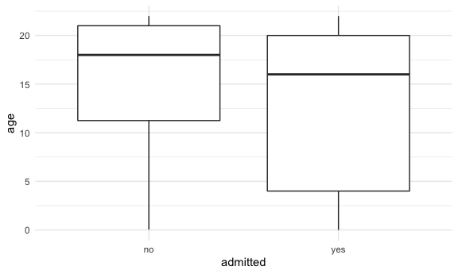
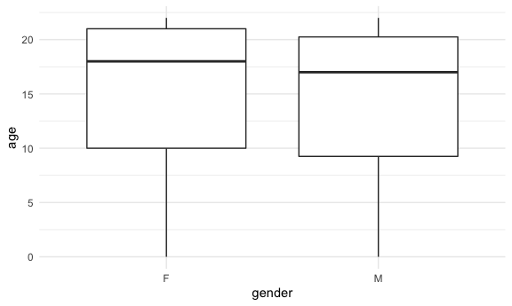
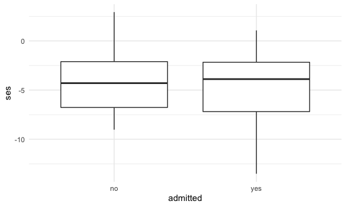
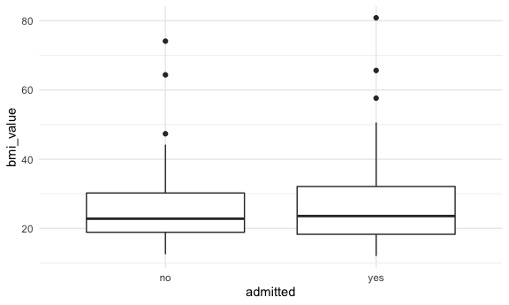
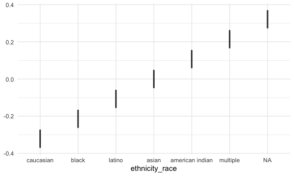

visualizations
================

``` r
library(tidyverse)
library(usa)
library(mice)

knitr::opts_chunk$set(
  fig.width = 6,
  fig.asp = .6,
  out.width = "90%")

theme_set(theme_minimal() + theme(legend.position = "bottom"))

options(
  ggplot2.continuous.colour = "viridis",
  ggplot2.continuous.fill = "viridis")

scale_colour_discrete = scale_color_viridis_d
scale_fill_discrete = scale_fill_viridis_d

knitr::opts_chunk$set(comment = NA, message = FALSE, warning = FALSE, echo = TRUE)
```

Read in and tidy the data.

``` r
# Load and tidy data
ped_covid =
  read_csv("./data/p8105_final_ped_covid.csv") %>%
  mutate(
    ethnicity_race = case_when(
      race == "R3 Black or African-American"        ~ "black",
      race == "R2 Asian"                            ~ "asian",
      race == "R5 White"                            ~ "caucasian",
      race == "R1 American Indian or Alaska Native" ~ "american indian",
      race == "Multiple Selected"                   ~ "multiple",
      ethnicity == "E1 Spanish/Hispanic/Latino"     ~ "latino"
    )
  ) %>%
  mutate(
    asthma = replace_na(asthma_dx, 0),
    asthma = str_replace(asthma, ".*J.*", "1"),
    diabetes = replace_na(diabetes_dx, 0),
    diabetes = str_replace(diabetes, ".*E.*", "1"),
    zip = as.character(zip_code_set),
    service = outcomeadmission_admission_1inpatient_admit_service, 
    ed = ed_yes_no_0_365_before,
    admission_dx = admission_apr_drg,
    icu = icu_yes_no
  ) %>%
  mutate(obesity = case_when(
    bmi_value >= 30 ~ "1",
    bmi_value < 30 ~"0"
  ))
```

``` r
# Merge zipcode data with latitude and longitude.
zipcode_df = 
  usa::zipcodes

ped_covid = 
  left_join(ped_covid, zipcode_df, by = "zip") %>%
  select(admitted, age, gender, ses, zip, eventdatetime, bmi_value, icu, icu_date_time, 
         systolic_bp_value, ethnicity_race, asthma, diabetes, zip, service, ed, admission_dx,
         city.y, obesity, lat, long) %>%
  mutate_at(c("admitted", "icu", "ethnicity_race", "asthma", "diabetes",
              "ed", "city.y", "obesity"), as.factor) %>%
  mutate(
    gender = factor(gender, levels = c("F", "M")),
    ethnicity_race = factor(ethnicity_race, levels = c("caucasian", "black", "latino", "asian", "american indian", "multiple", "NA"))
  ) %>%
  rename(city = city.y) 
```

``` r
# Impute missing data
impute = mice(ped_covid, m=3, seed=111)
```

``` 

 iter imp variable
  1   1  gender  ses  bmi_value  systolic_bp_value  ethnicity_race  city  obesity  lat  long
  1   2  gender  ses  bmi_value  systolic_bp_value  ethnicity_race  city  obesity  lat  long
  1   3  gender  ses  bmi_value  systolic_bp_value  ethnicity_race  city  obesity  lat  long
  2   1  gender  ses  bmi_value  systolic_bp_value  ethnicity_race  city  obesity  lat  long
  2   2  gender  ses  bmi_value  systolic_bp_value  ethnicity_race  city  obesity  lat  long
  2   3  gender  ses  bmi_value  systolic_bp_value  ethnicity_race  city  obesity  lat  long
  3   1  gender  ses  bmi_value  systolic_bp_value  ethnicity_race  city  obesity  lat  long
  3   2  gender  ses  bmi_value  systolic_bp_value*  ethnicity_race  city  obesity  lat  long
  3   3  gender  ses  bmi_value  systolic_bp_value  ethnicity_race  city  obesity  lat  long
  4   1  gender  ses  bmi_value  systolic_bp_value  ethnicity_race  city  obesity  lat  long
  4   2  gender  ses  bmi_value  systolic_bp_value  ethnicity_race  city  obesity  lat  long
  4   3  gender  ses  bmi_value  systolic_bp_value  ethnicity_race  city  obesity  lat  long
  5   1  gender  ses  bmi_value  systolic_bp_value  ethnicity_race  city  obesity  lat  long
  5   2  gender  ses  bmi_value  systolic_bp_value  ethnicity_race  city  obesity  lat  long
  5   3  gender  ses  bmi_value  systolic_bp_value  ethnicity_race  city  obesity  lat  long
```

``` r
datacomplete = complete(impute,2)
```

``` r
# Export csv
write_csv(datacomplete, "datacomplete.csv")
```

Some exploratory data visualizations

``` r
#bunch of ggplots
ped_covid %>% 
  ggplot(aes(x = admitted, y = age)) +
  geom_boxplot()
```



``` r
ped_covid %>% 
  filter(
    gender != "NA"
  ) %>% 
  ggplot(aes(x = gender, y = age)) +
  geom_boxplot()
```



``` r
ped_covid %>% 
  ggplot(aes(x = admitted, y = ses)) +
  geom_boxplot()
```



``` r
ped_covid %>% 
  ggplot(aes(x = admitted, y = bmi_value)) +
  geom_boxplot()
```



``` r
ped_covid %>% 
  count(icu)
```

    # A tibble: 2 x 2
      icu       n
      <fct> <int>
    1 0       355
    2 1        20

``` r
ped_covid %>% count(ethnicity_race)
```

    # A tibble: 7 x 2
      ethnicity_race      n
      <fct>           <int>
    1 caucasian          18
    2 black              75
    3 latino            189
    4 asian               8
    5 american indian     1
    6 multiple            8
    7 <NA>               76

``` r
ped_covid %>% 
  ggplot(aes(x = ethnicity_race)) + 
  geom_boxplot()
```



Univariate models

``` r
#bunch of univariate logisitic regression models
glm(
  admitted ~ age,
  data = ped_covid,
  family = binomial()
  ) %>% 
  broom::tidy()
```

    # A tibble: 2 x 5
      term        estimate std.error statistic p.value
      <chr>          <dbl>     <dbl>     <dbl>   <dbl>
    1 (Intercept)  -0.0793    0.233     -0.341 0.733  
    2 age          -0.0430    0.0147    -2.93  0.00337

``` r
#p = 0.00337

glm(
  admitted ~ gender,
  data = ped_covid,
  family = binomial()
  ) %>% 
  broom::tidy()
```

``` 
# A tibble: 2 x 5
  term        estimate std.error statistic    p.value
  <chr>          <dbl>     <dbl>     <dbl>      <dbl>
1 (Intercept)  -0.717      0.155    -4.63  0.00000369
2 genderM       0.0402     0.220     0.183 0.855     
```

``` r
#p = 0.855

glm(
  admitted ~ bmi_value,
  data = ped_covid,
  family = binomial()
  ) %>% 
  broom::tidy()
```

    # A tibble: 2 x 5
      term        estimate std.error statistic p.value
      <chr>          <dbl>     <dbl>     <dbl>   <dbl>
    1 (Intercept)  -0.528     0.337      -1.57   0.117
    2 bmi_value     0.0137    0.0122      1.12   0.263

``` r
#p = 0.263

glm(
  admitted ~ obesity,
  data = ped_covid,
  family = binomial()
  ) %>% 
  broom::tidy()
```

    # A tibble: 2 x 5
      term        estimate std.error statistic p.value
      <chr>          <dbl>     <dbl>     <dbl>   <dbl>
    1 (Intercept)   -0.247     0.147    -1.68   0.0934
    2 obesity1       0.247     0.278     0.889  0.374 

``` r
#p = 0.374

glm(
  admitted ~ asthma,
  data = ped_covid,
  family = binomial()
  ) %>% 
  broom::tidy()
```

    # A tibble: 2 x 5
      term        estimate std.error statistic  p.value
      <chr>          <dbl>     <dbl>     <dbl>    <dbl>
    1 (Intercept)   -0.790     0.122     -6.49 8.64e-11
    2 asthma1        0.560     0.285      1.96 4.96e- 2

``` r
#p = 4.96e- 2

glm(
  admitted ~ diabetes,
  data = ped_covid,
  family = binomial()
  ) %>% 
  broom::tidy()
```

    # A tibble: 2 x 5
      term        estimate std.error statistic  p.value
      <chr>          <dbl>     <dbl>     <dbl>    <dbl>
    1 (Intercept)   -0.787     0.114     -6.90 5.10e-12
    2 diabetes1      1.97      0.583      3.37 7.48e- 4

``` r
#p = 7.48e- 4

glm(
  admitted ~ ethnicity_race,
  data = ped_covid,
  family = binomial()
  ) %>% 
  broom::tidy()
```

    # A tibble: 6 x 5
      term                          estimate std.error statistic p.value
      <chr>                            <dbl>     <dbl>     <dbl>   <dbl>
    1 (Intercept)                     -0.223     0.474  -0.470     0.638
    2 ethnicity_raceblack             -0.411     0.533  -0.771     0.441
    3 ethnicity_racelatino            -0.423     0.498  -0.848     0.396
    4 ethnicity_raceasian             -0.288     0.871  -0.330     0.741
    5 ethnicity_raceamerican indian  -16.3    2400.     -0.00681   0.995
    6 ethnicity_racemultiple         -16.3     848.     -0.0193    0.985

``` r
#no significant p values
```

``` r
#fitting multivariate logistic regression model
glm(
  admitted ~ age + gender + ethnicity_race + asthma + diabetes + obesity,
  data = ped_covid,
  family = binomial()
  ) %>% 
  broom::tidy() %>% 
  mutate(
    OR = exp(estimate),
    CI_lower = exp(estimate - 1.96 * std.error),
    CI_upper = exp(estimate + 1.96 * std.error)
  ) %>% 
  select(term, OR, starts_with("CI"), p.value) %>% 
  knitr::kable(digits = 3)
```

| term                           |    OR | CI\_lower | CI\_upper | p.value |
| :----------------------------- | ----: | --------: | --------: | ------: |
| (Intercept)                    | 5.101 |     1.134 |    22.939 |   0.034 |
| age                            | 0.938 |     0.897 |     0.981 |   0.005 |
| genderM                        | 0.728 |     0.409 |     1.295 |   0.280 |
| ethnicity\_raceblack           | 0.336 |     0.086 |     1.318 |   0.118 |
| ethnicity\_racelatino          | 0.344 |     0.092 |     1.286 |   0.113 |
| ethnicity\_raceasian           | 0.323 |     0.044 |     2.371 |   0.266 |
| ethnicity\_raceamerican indian | 0.000 |     0.000 |       Inf |   0.986 |
| asthma1                        | 0.931 |     0.468 |     1.856 |   0.840 |
| diabetes1                      | 3.764 |     1.100 |    12.880 |   0.035 |
| obesity1                       | 2.166 |     1.070 |     4.384 |   0.032 |
